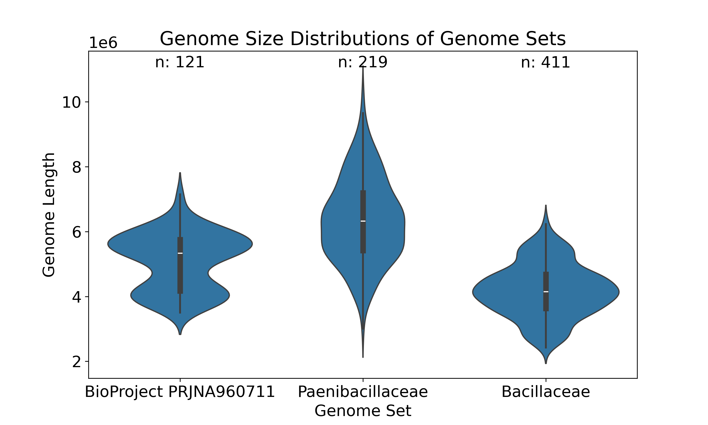

# Genome Size Distributions of the Families Represented in BioProject PRJNA960711
In order to compare the genome sizes of the assemblies of BioProject PRJNA960711 with that expected for genomes of their famillies, *Paenibacillaceae* and *Bacillaceae*, we generated violin plots from the lengths of reference genomes from those two taxons and all 121 of our assemblies.

# Data Sourcing from NCBI
The data was sourced from [NCBI's genome database](https://www.ncbi.nlm.nih.gov/datasets/genome/?bioproject=PRJNA960711) with 'Scientific name', 'Modifier', and 'Size (Mb)' as selected columns before downloading the summary tables for the Bioproject PRJNA960711 genomes, and all reference genomes at 'scaffold+' level of the families *Bacillaceae* and *Paenibacillaceae*, removing duplicates from the full dataset.

# Violin Plots with MatplotLib

Violin plots were made in the jupyter notebook [genome_size_distribution.ipynb](src/notebooks/genome_size_distribution.ipynb), resulting in the following plot:

The bimodal genome size distribution of BioProject PRJNA960711 falls within the combined range of the represented families.

